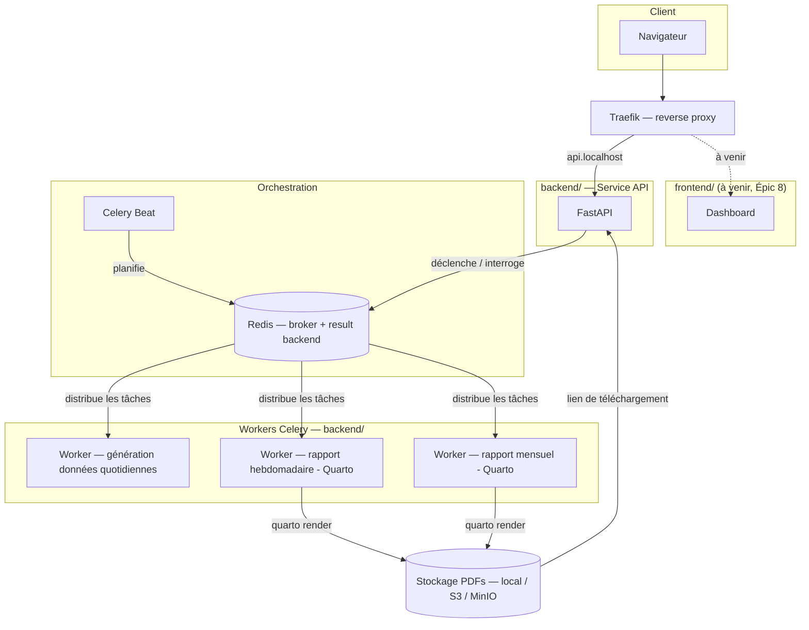

# Plan de travail — Générateur automatisé de rapports PDF

## 1. Objet de la démo

Démontrer une architecture backend capable de générer automatiquement des rapports PDF (hebdomadaire et mensuels) à partir de données produites quotidiennement, avec un pipeline de traitement asynchrone distribué et une API permettant de suivre l'exécution des tâches depuis un dashboard frontend.

L'objectif de la démo est de valider :
- la capacité à orchestrer des tâches planifiées et asynchrones à l'échelle (Celery + Redis),
- la génération de documents PDF riches (cartes, graphiques, tables) via Quarto,
- l'exposition d'une API REST permettant de déclencher et suivre ces traitements,
- une base saine pour un futur frontend de monitoring.

## 2. Périmètre fonctionnel

### Inclus dans le périmètre

- Génération de données simulées ou agrégées toutes les heures (job périodique).
- Génération d'un rapport PDF hebdomadaire (agrégation des données sur 7 jours).
- Génération d'un rapport PDF mensuel (agrégation des rapports des 4 rapports hebdomadaires du mois courant).
- Un template de rapport unique (Quarto), paramétrable par date/période.
- Le rapport contient : au moins une carte statique, un ou plusieurs graphiques, une ou plusieurs tables de données.
- API REST permettant de :
  - déclencher manuellement une génération (hors planification),
  - lister l'historique des tâches et leur statut,
  - récupérer le PDF généré (lien de téléchargement),
  - consulter l'état d'avancement d'une tâche en cours.
- Stockage des PDFs générés avec traçabilité (métadonnées : date, période, statut, durée).

### Hors périmètre (pour cette démo)

- Authentification/autorisation avancée (multi-utilisateurs, rôles).
- Développement du frontend dashboard lui-même (l'API est prête à le consommer, le frontend est un chantier séparé).
- Templates multiples ou personnalisables par utilisateur.
- Cartes interactives dans le PDF (non supporté nativement — cartes statiques uniquement).
- Scalabilité multi-nœuds / déploiement production (Kubernetes, haute disponibilité).

## 3. Sources de données

Pas de source unique « officielle » : la démo combine trois jeux de données publics chargés en local dans `/data`, joints sur le code INSEE commune.

### 3.1 Indice ATMO quotidien (source métier principale)

- Fichier : `data/indice_ATMO_2026-1-1_2026-7-22_commune.csv`
- Colonnes : `date`, `lib_zone`, `code_zone` (INSEE), `qualificatif` (indice qualité de l'air), `type` (prevision/observation), `source`.
- 73 690 lignes, **363 codes zone distincts** — Air Pays de la Loire publie l'indice par « commune représentative de zone », pas pour les 1228 communes de la région. Ne pas s'attendre à une couverture exhaustive lors des jointures géo.
- C'est le flux quotidien simulé à agréger pour les rapports hebdo/mensuel.

### 3.2 Limites communales — georef-france-commune (Opendatasoft, non officiel)

- Source : `https://public.opendatasoft.com/api/explore/v2.1/catalog/datasets/georef-france-commune/exports/parquet?lang=fr`
- Téléchargé puis filtré sur `reg_code = '52'` (Pays de la Loire) → `data/geo/communes_pays_de_la_loire.geojson` (1228 communes, EPSG:4326).
- Colonnes conservées : `insee_code`, `commune_nom`, `insee_code_actuel`, `dept_code`, `dept_nom`, `region_code`, `region_nom`, `epci_code`, `epci_nom`, `arrondissement_code`, `arrondissement_nom`, `siren_code`, `geometry`.
- Usage : carte statique du rapport (choroplèthe par indice ATMO), agrégations département/EPCI/arrondissement.
- Jointure avec le CSV ATMO : `code_zone` = `insee_code`. 361/363 codes matchent directement (2 écarts probables liés à des communes nouvelles — `72287`, `72298` — à vérifier via `insee_code_actuel`).
- Source communautaire, non officielle : suffisante pour une démo, pas pour un usage réglementaire.

### 3.3 Agrégation EPCI — collectivites-locales.gouv.fr (officiel, DGCL)

- Source : `https://www.collectivites-locales.gouv.fr/files/files/Etudes-et-statistiques/DESL/2026/EPCI/epcicom2026.xlsx`
- Filtré sur les départements de la région (44, 49, 53, 72, 85) → `data/geo/epci_communes_pays_de_la_loire.csv` (1219 lignes, une par commune membre).
- Colonnes : `dept`, `siren`, `raison_sociale` (nom EPCI), `nature_juridique`, `mode_financ`, `nb_membres`, `total_pop_tot`, `total_pop_mun`, `dep_com`, `insee` (code commune), `siren_membre`, `nom_membre`, `ptot_2026`, `pmun_2026`.
- Usage : population officielle par commune/EPCI (pondération d'agrégats), validation croisée de la référence EPCI face à la source Opendatasoft (3.2).
- Jointure : `insee` = `insee_code` (3.2) = `code_zone` (3.1).

### 3.4 Référentiel communal (à construire, Épic 2)

Un référentiel unique doit être matérialisé une fois au démarrage (job d'init ou fixture), combinant géométrie + attributs admin (3.2) et population/EPCI officielle (3.3), exposé aux workers de génération de rapport via jointure `code_zone` / `insee_code` / `insee`.

## 4. Stack technique

| Composant | Choix retenu | Justification |
|---|---|---|
| Framework API | **FastAPI** | Async natif adapté à l'I/O-bound (déclenchement/suivi de tâches), validation via Pydantic, doc OpenAPI générée |
| Orchestration des tâches | **Celery** | Standard mature pour tâches asynchrones distribuées en Python |
| Planification | **Celery Beat** | Gestion des jobs périodiques (génération horaire, quotidienne, hebdomadaire) sans cron externe |
| Broker + result backend | **Redis** | Simplicité de déploiement (un seul service pour les deux rôles), suffisant pour la volumétrie visée |
| Base de données | **SQLite** (fichier sur volume Docker partagé) | Pas de serveur DB séparé à opérer pour la démo ; fichier partagé en lecture/écriture entre les workers ingestion/hebdo/mensuel. Concurrence en écriture limitée — à reconsidérer (Postgres) si plusieurs workers écrivent au même instant à fort volume |
| Génération de PDF | **Quarto** (+ Typst comme moteur de rendu) | Exécution native de code Python, rendu intégré des graphiques/tables, rapports paramétrés via YAML |
| Visualisations | matplotlib / plotly (export statique via kaleido), geopandas pour les cartes | Rendu statique compatible PDF |
| Stockage des fichiers | Local (démo) / MinIO ou S3 (évolution) | Découplage stockage/workers si besoin de montée en charge |
| Monitoring des tâches | **Flower** (interne/debug) + endpoints custom FastAPI | Flower pour l'observabilité technique, API custom pour alimenter le futur dashboard |
| Reverse proxy | **Traefik** | Point d'entrée unique (`api.localhost`), prêt à router le frontend (`/frontend`, à venir) sans reconfiguration de l'API |

### Alternatives écartées

- **DRF** écarté au profit de FastAPI : le périmètre est majoritairement I/O-bound (déclenchement/suivi), pas de besoin d'admin Django ni de permissions complexes.
- **RabbitMQ** écarté au profit de Redis pour cette démo : la volumétrie et les besoins de fiabilité ne justifient pas la complexité opérationnelle supplémentaire. À reconsidérer si montée en charge significative ou besoin de routing avancé.
- **Jinja2 + WeasyPrint** écarté au profit de Quarto : le besoin de cartes/graphiques/tables intégrés rend Quarto plus efficace malgré une installation plus lourde (CLI + moteur Typst).

### Organisation des dossiers

Monorepo `/backend` + `/frontend` :
- `backend/` — API FastAPI, workers Celery, tests (contenu des épics 1-2, voir §6).
- `frontend/` — vide pour l'instant, réservé au futur dashboard (Épic 8). Traefik est déjà configuré pour le router (`traefik/dynamic.yml`) une fois un service ajouté à `docker-compose.yml`.
- `data/` — sources brutes (§3), partagées en lecture seule par les workers backend, hors du dossier `backend/`.

## 5. Schéma d'architecture

**Flux de génération d'un rapport :**
1. Celery Beat déclenche (ou l'API reçoit une demande manuelle) une tâche de génération, sur la queue dédiée (`reports-weekly` ou `reports-monthly`).
2. Le worker calcule la période (7 jours glissants, ou mois courant) et appelle `quarto render report_template.qmd -P start_date:... -P end_date:... --to typst` — le template lit directement `hourly_readings`/`communes` en SQLite, pas d'export intermédiaire.
3. Le PDF est rendu à côté du template puis déplacé vers le stockage (`var/reports/`, volume Docker partagé) — Épic 6 ajoutera métadonnées et traçabilité.
4. Le statut de la tâche est mis à jour dans Redis (result backend) et consultable via l'API.

## 6. Épics pour la roadmap

### Épic 1 — Socle technique
Mise en place du squelette du projet : structure des dossiers (`backend/` + `frontend/`, cf. §4), `docker-compose` (Traefik, API, Redis, worker(s), Celery Beat), configuration des environnements, CI minimale.

### Épic 2 — Référentiel communal et pipeline de données horaires
Construction du référentiel communal (job d'init, cf. §3.4) à partir de `communes_pays_de_la_loire.geojson` et `epci_communes_pays_de_la_loire.csv`. Génération/simulation des données horaires à partir du CSV ATMO (§3.1), modèle de stockage (DB ou fichiers structurés), tâche Celery périodique associée.

### Épic 3 — Template de rapport Quarto
Conception du template `.qmd` unique et paramétré : structure du rapport, table des données, graphiques d'évolution de l'indice ATMO. Carte statique en choroplèthe (geopandas, jointure `code_zone`/`insee_code` sur le référentiel communal Pays de la Loire) — limiter l'affichage aux communes couvertes par une valeur d'indice (§3.1) et griser/exclure les autres. Validation du rendu PDF via Typst.

### Épic 4 — Orchestration des tâches de génération
Tâches Celery pour le rapport hebdomadaire (7 derniers jours complets) et mensuel (mois courant — même template que l'hebdo, période élargie ; §2), Celery Beat (lundi 2h / 1er du mois 3h), queues dédiées par type de tâche (`ingestion`, `reports-weekly`, `reports-monthly`) avec un worker Docker par queue. Intégration de Quarto + Typst dans l'image Docker backend (tarball CLI, pas de paquet système).

### Épic 5 — API REST
Endpoints FastAPI : déclenchement manuel, consultation de l'historique, suivi du statut d'une tâche, récupération du PDF généré. Documentation OpenAPI.

### Épic 6 — Stockage et traçabilité
Mise en place du stockage des PDFs (local puis migration S3/MinIO), modèle de métadonnées (date, période, statut, durée, taille, chemin).

### Épic 7 — Observabilité
Intégration de Flower pour le monitoring technique des workers/queues. Mise en place du endpoint de suivi consommable par le futur dashboard (statuts, progress, historique).

### Épic 8 — Préparation du frontend (hors périmètre démo, à cadrer)
Dossier `frontend/` et routage Traefik déjà en place (cf. §4). Reste à cadrer séparément : spécification des contrats d'API nécessaires au dashboard (liste des tâches, détail, actions), maquettage éventuel, bootstrap de l'application — chantier séparé de cette démo backend.
